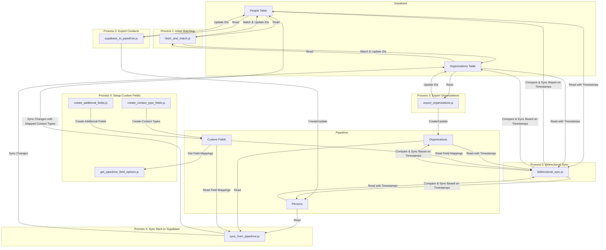

# Supabase to Pipedrive Integration

This project provides bi-directional synchronization between a Supabase database and Pipedrive CRM.

## Features

- **Bi-directional Synchronization**: Keep your Supabase and Pipedrive data in sync in both directions
- **Export to Pipedrive**:
  - Exports contacts from Supabase's `people` table to Pipedrive
  - Exports organizations from Supabase's `organizations` table to Pipedrive
  - Creates new records in Pipedrive for entities that don't exist
  - Updates existing records in Pipedrive if they already exist (matching by pipedrive_id)
  - Syncs contact type fields (primary and secondary) with custom field mapping
- **Import from Pipedrive**:
  - Syncs changes made in Pipedrive back to Supabase
  - Updates contact information, organization relationships, and custom fields
  - Precisely maps Pipedrive contact type IDs to Supabase contact type strings
- **Duplicate Prevention**: 
  - Uses email and domain matching to link existing records
  - Stores Pipedrive IDs in Supabase for future updates
  - Checks for existing records before creating new ones
- **Error Handling**:
  - Handles rate limits with exponential backoff
  - Provides detailed logging
  - Gracefully handles errors during sync
- **Contact Type Mapping**:
  - Accurately maps between Pipedrive contact type IDs and Supabase string values
  - Supports both primary and secondary contact types
  - Dynamically fetches exact mappings from Pipedrive API

## Prerequisites

- Node.js (v14 or higher)
- npm or yarn
- A Supabase account with `people` and `organizations` tables
- A Pipedrive account with API access

## Installation

1. Clone this repository or download the files
2. Navigate to the project directory
3. Install dependencies:

```bash
npm install
# or
yarn install
```

## Configuration

1. Create a `.env` file in the project root (or copy the `.env.example` file)
2. Add your credentials to the `.env` file:

```
# Supabase credentials
SUPABASE_URL=your_supabase_url
SUPABASE_SERVICE_KEY=your_supabase_service_key

# Pipedrive credentials
PIPEDRIVE_API_TOKEN=your_pipedrive_api_token
```

## Scripts Overview

This project includes several scripts for different synchronization needs:

| Script | Description |
|--------|-------------|
| `sync_pipedrive_ids_with_retries.js` | Pre-sync existing records by matching emails and domains with retry logic |
| `fetch_and_match.js` | Alternative approach that fetches all data from Pipedrive first, then matches locally |
| `supabase_to_pipedrive.js` | Main script to export contacts from Supabase to Pipedrive |
| `export_organizations.js` | Export all organizations from Supabase to Pipedrive |
| `sync_from_pipedrive.js` | Sync changes made in Pipedrive back to Supabase |
| `inspect_pipedrive_fields.js` | Utility to list available fields in your Pipedrive instance |
| `get_pipedrive_field_options.js` | Fetch exact contact type field mappings from Pipedrive API |
| `create_contact_type_fields.js` | Create custom contact type fields in Pipedrive |
| `create_additional_fields.js` | Create additional custom fields in Pipedrive |
| `bidirectional_sync.js` | Complete bi-directional sync with timestamp conflict resolution |

## Usage

### Step 1: Initial Setup (Custom Fields)

Before starting synchronization, ensure that Pipedrive has the necessary custom fields:

```bash
# Create contact type fields in Pipedrive
node create_contact_type_fields.js

# Create additional custom fields in Pipedrive
node create_additional_fields.js

# Fetch exact contact type field mappings from Pipedrive API
node get_pipedrive_field_options.js
```

The `get_pipedrive_field_options.js` script will output the exact mapping between Pipedrive contact type IDs and their text values, which can be used to update the `sync_from_pipedrive.js` script if needed.

### Step 2: Initial Synchronization

Before starting the bi-directional sync, it's recommended to first establish links between existing records:

```bash
node fetch_and_match.js
```

This script will:
1. Fetch all organizations and people from Pipedrive
2. Fetch all organizations and people from Supabase
3. Match records based on domains, emails, and names
4. Update Supabase records with matching Pipedrive IDs

### Step 3: Export from Supabase to Pipedrive

After establishing the initial links, you can export all data to Pipedrive:

```bash
# Export contacts
node supabase_to_pipedrive.js

# Export organizations
node export_organizations.js
```

### Step 4: Sync Changes from Pipedrive to Supabase

To pull changes made in Pipedrive back to Supabase:

```bash
node sync_from_pipedrive.js
```

This script will:
1. Fetch all records from Pipedrive (people and organizations)
2. Compare with Supabase data
3. Update Supabase records with changes made in Pipedrive
4. Accurately map contact type IDs to their corresponding string values

### Step 5: Bidirectional Synchronization with Timestamp-Based Conflict Resolution

For complete bi-directional synchronization with proper conflict resolution based on timestamps:

```bash
node bidirectional_sync.js
```

This script will:
1. Fetch all records from both Pipedrive and Supabase
2. Compare timestamps to determine which system has the most recent version of each record
3. Intelligently update records in either system based on which has the most recent changes
4. Track synchronization state using the `last_pipedrive_sync` timestamp in Supabase
5. Create new records in either system as needed

#### Prerequisites for Timestamp-Based Sync

To use the timestamp-based synchronization, your Supabase database must have:
- An `updated_at` column in both `people` and `organizations` tables
- A `last_pipedrive_sync` column to track when records were last synchronized
  
If these columns don't exist, you'll need to add them with commands like:

```sql
ALTER TABLE people ADD COLUMN IF NOT EXISTS last_pipedrive_sync TIMESTAMP WITH TIME ZONE;
ALTER TABLE organizations ADD COLUMN IF NOT EXISTS last_pipedrive_sync TIMESTAMP WITH TIME ZONE;

-- Ensure updated_at columns exist and are automatically updated
ALTER TABLE people 
  ADD COLUMN IF NOT EXISTS updated_at TIMESTAMP WITH TIME ZONE DEFAULT NOW(),
  ADD TRIGGER IF NOT EXISTS set_updated_at
  BEFORE UPDATE ON people
  FOR EACH ROW
  EXECUTE FUNCTION public.set_updated_at();

ALTER TABLE organizations 
  ADD COLUMN IF NOT EXISTS updated_at TIMESTAMP WITH TIME ZONE DEFAULT NOW(),
  ADD TRIGGER IF NOT EXISTS set_updated_at
  BEFORE UPDATE ON organizations
  FOR EACH ROW
  EXECUTE FUNCTION public.set_updated_at();
```

Make sure to create the `set_updated_at()` function first if it doesn't exist:

```sql
CREATE OR REPLACE FUNCTION public.set_updated_at()
RETURNS TRIGGER AS $$
BEGIN
  NEW.updated_at = NOW();
  RETURN NEW;
END;
$$ LANGUAGE plpgsql;
```

### Step 6: Ongoing Synchronization

For ongoing synchronization, you can:

1. Run `bidirectional_sync.js` to perform a complete, timestamp-based bidirectional sync
2. Alternatively, run the individual scripts for specific operations:
   - `supabase_to_pipedrive.js` to push Supabase changes to Pipedrive
   - `export_organizations.js` when you add new organizations to Supabase
   - `sync_from_pipedrive.js` to pull changes from Pipedrive to Supabase

You could also set up scheduled tasks to run these scripts automatically at regular intervals.

## Contact Type Mapping

The integration includes special handling for contact type fields:

- **Primary Contact Type**: Maps between Pipedrive custom field options and Supabase string values
- **Secondary Contact Type**: Also maps between Pipedrive custom field options and Supabase string values

The mapping is done using exact values fetched from the Pipedrive API, ensuring accurate synchronization of contact types.

### Updating Contact Type Mapping

If you update the contact types in Pipedrive, run:

```bash
node get_pipedrive_field_options.js
```

This will output the updated mapping that you can use to update the `sync_from_pipedrive.js` script.

## Data Mapping

### Supabase to Pipedrive

| Supabase Field      | Pipedrive Field    |
|---------------------|-------------------|
| full_name           | name              |
| work_email          | email (work)      |
| personal_email      | email (personal)  |
| phone               | phone (main)      |
| title               | Job Title (custom)|
| notes               | notes             |
| linkedin_profile    | LinkedIn Profile (custom) |
| primary_contact_type | Primary Contact Type (custom) |
| secondary_contact_type | Secondary Contact Type (custom) |
| headline            | Headline (custom) |
| summary             | Summary (custom)  |
| num_followers       | LinkedIn Followers (custom) |
| location_name       | Location (custom) |
| organizations.name  | organization      |

### Pipedrive to Supabase

| Pipedrive Field        | Supabase Field    |
|------------------------|-------------------|
| name                   | full_name         |
| email (work)           | work_email        |
| email (personal)       | personal_email    |
| phone                  | phone             |
| Job Title (custom)     | title             |
| notes                  | notes             |
| LinkedIn Profile (custom) | linkedin_profile |
| Primary Contact Type (custom) | primary_contact_type |
| Secondary Contact Type (custom) | secondary_contact_type |
| Headline (custom)      | headline          |
| Summary (custom)       | summary           |
| LinkedIn Followers (custom) | num_followers    |
| Location (custom)      | location_name     |
| organization           | organization_id   |

## Synchronization Flow



## Troubleshooting

- **Rate Limits**: If you encounter rate limit errors, the scripts include retry logic with exponential backoff
- **Missing Fields**: Use `inspect_pipedrive_fields.js` to check available fields in your Pipedrive instance
- **Duplicate Records**: Run `fetch_and_match.js` to properly link existing records before exporting 
- **Contact Type Mapping Issues**: Run `get_pipedrive_field_options.js` to get the exact mapping between Pipedrive contact type IDs and their text values
- **Custom Fields Missing**: Ensure you've run `create_contact_type_fields.js` and `create_additional_fields.js` to set up all required custom fields 

## Archive

Note: The individual one-way sync scripts (`supabase_to_pipedrive.js` and `sync_from_pipedrive.js`) have been replaced by the more robust bidirectional sync script (`bidirectional_sync.js`). Copies of the original scripts are stored in the `/archive` directory for reference, but they are no longer needed for regular operation.

For most use cases, simply run the bidirectional sync script:

```bash
node bidirectional_sync.js
```

This will intelligently synchronize records in both directions based on timestamps.

## Bidirectional Synchronization

The bidirectional sync script (`bidirectional_sync.js`) allows for full two-way synchronization between Supabase and Pipedrive with timestamp-based conflict resolution.

### What Gets Synchronized

#### Organizations
- From Pipedrive to Supabase: name, website_url
- From Supabase to Pipedrive: name, website_url

#### Contacts/People
- From Pipedrive to Supabase: name, email, phone, organization, notes, custom fields (headline, summary, LinkedIn profile, followers, location, job title, contact types)
- From Supabase to Pipedrive: name, email, phone, organization, notes, custom fields

### Data Preservation
The bidirectional sync is designed to be safe and non-destructive:

- **Supabase-specific fields**: Fields that only exist in Supabase (like EIN numbers, funding program URLs, etc.) are preserved and never overwritten during sync.
- **Contact-specific data**: Special fields like contact types are properly mapped between systems.
- **Selective updates**: Only fields that have changed are updated, minimizing the risk of data loss.
- **Timestamp-based conflict resolution**: The system with the most recent update "wins" when both systems have changes.

## Usage

To run the bidirectional sync:

```bash
node bidirectional_sync.js
```

For scheduled synchronization, consider setting up a cron job:

```bash
# Example: Run bidirectional sync every 2 hours
0 */2 * * * cd /path/to/supabase-to-pipedrive && node bidirectional_sync.js >> sync_log.txt 2>&1
``` 